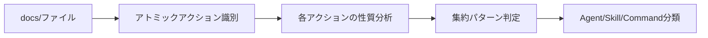
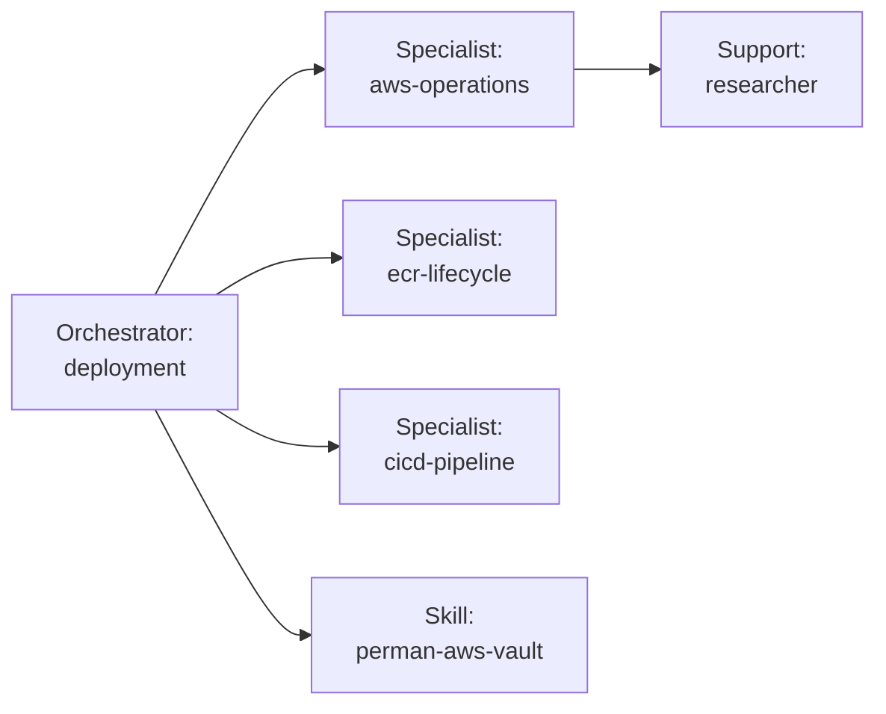
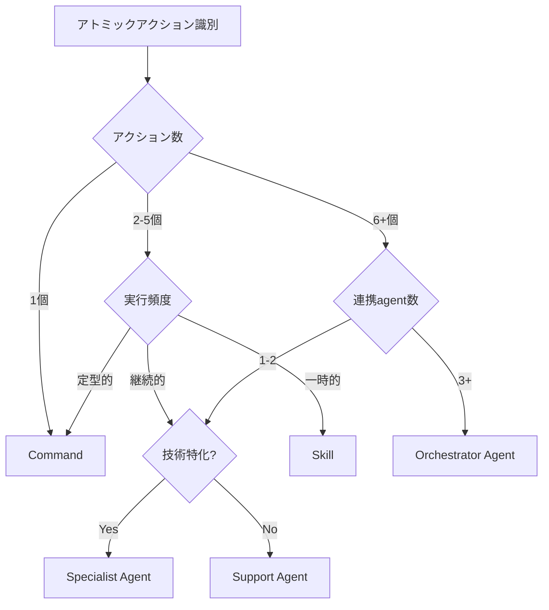

# 🎮 Skill Up - ドキュメントをAgent/Skill/Commandに変換

docs/配下のドキュメントを精査し、適切なものを`~/.claude/agents/`, `~/.claude/skills/`, または`~/.claude/commands/`に変換するコマンドです。

## 📋 概要

**RPGメタファー**: ドキュメントから「スキル」を獲得し、対話可能な形に進化させます。

```
経験値を記録     → /learnings "TypeScriptの型パターン"
スキルを獲得     → /skill-up
スキルを活用     → agent/skill/commandとして実行可能に
```

## 🎯 使用方法

### 基本実行

```bash
# フル分析 → 計画提示 → 実行
/skill-up

# ドライラン（分析と計画のみ、実行なし）
/skill-up --dry-run
```

### 選択的実行

```bash
# Agent化のみ
/skill-up --agents-only

# Skill化のみ
/skill-up --skills-only

# Command化のみ
/skill-up --commands-only
```

## 🧩 基礎概念: Atomic Action（最小単位）

すべての分類はまず「1つのアトミックなアクション」を識別することから始まります。

### アトミックアクションとは

**定義**: ユーザーが達成したい最小の価値単位

- **これ以上分割できない独立した操作**
- **入力・処理・出力が明確**
- **単独で意味を持つ**

### 識別方法

1. **動詞を抽出**: docs/ファイルから「〜する」という動詞を全て抽出
2. **独立性を確認**: 各動詞が単独で価値を提供するか確認
3. **依存関係をマッピング**: アクション間の順序・条件を整理

### 具体例: deployment.mdの分解

```markdown
# deployment.md → 6つのアトミックアクションに分解

1. バージョン更新 (pnpm version patch/minor/major)
2. 品質チェック実行 (mise run ci)
3. リリースPR作成 (gh pr create)
4. ECRイメージ確認 (aws ecr describe-images)
5. ECSデプロイ実行 (gh workflow run)
6. デプロイ検証 (ECS状態確認、ログ監視)

→ 6つの最小単位が「線形」に連携
→ 判断ポイント: 4箇所（環境選択、タグ選択、承認、ロールバック判断）
→ システム状態変更: 大（ECS、ECR、GitHub）
→ 外部連携: 3+ agent/skill (aws-operations, ecr-lifecycle, cicd-pipeline)

結論: Orchestrator Agent に分類
```

### 分類プロセス



**3ステップ**:

1. **識別** → 何を達成したいか（アトミックアクション抽出）
2. **分析** → どのように達成するか（実行特性・依存関係・外部連携）
3. **分類** → 最適な形式を選択（Agent/Skill/Command）

## 📐 3パターン分類基準

### Agent化 - 継続運用型

**特徴**:

- ✅ 日常的な運用タスク
- ✅ 「〜して」と自然言語で依頼
- ✅ 対話的に実行
- ✅ 必要に応じてセッション管理

**基本判定条件**:

- 継続的に使用される
- 対話しながら実行する
- 実行のたびに内容が変わる可能性がある

#### Agent Type細分化

Agentはその役割により3つのタイプに分類されます。

##### 🎼 Orchestrator Agent（オーケストレーター型）

**役割**: 複数のSpecialist Agentやskillを調整・統合し、高レベルのワークフローを提供

**特徴**:

- タスクを複数のサブタスクに分解
- 適切なagent/skillを選択して実行
- 結果を統合してユーザーに提示
- 複数の判断ポイントで対話

**例**:

- `deployment` - リリースフロー管理、複数agent連携（aws-operations, ecr-lifecycle, cicd-pipeline）
- `quality-validation` - 型チェック・lint・テスト統合
- `cicd-pipeline` - GitHub Actions統合、品質チェック調整

**判定基準**:

- 3つ以上のagent/skillと連携
- 複数の専門領域にまたがる
- タスク分解と調整が主な役割

##### 🔧 Specialist Agent（専門家型）

**役割**: 特定ドメインの深い専門知識を提供し、継続的にサポート

**特徴**:

- 単一技術領域に特化
- 外部サービスとの連携（AWS、GitHub、DB等）
- 他のagentから再利用される
- ドメイン固有の判断を実行

**例**:

- `aws-operations` - ECS/ECR/CloudWatch管理
- `database-operations` - DBマイグレーション・SSHトンネル管理
- `terraform-operations` - インフラ変更
- `monitoring-alerts` - CloudWatch監視・アラート対応

**判定基準**:

- 特定技術スタックに特化
- 外部サービスとの直接連携
- 他のagentから呼び出される

##### 🛠️ Support Agent（サポート型）

**役割**: Orchestrator/Specialistの補助タスクを実行

**特徴**:

- 軽量・高速・単純な操作
- 限定的なスコープ
- 他のagentやコマンドから呼び出される
- コード分析・品質向上支援

**例**:

- `researcher` - コードベース探索・分析
- `docs-manager` - ドキュメント管理
- `error-fixer` - エラー検出・修正支援
- `debug-operations` - デバッグ支援

**判定基準**:

- 他のagentから呼び出される
- 限定的なスコープ
- 内部処理が中心（外部連携は最小限）

### Skill化 - ワークフロー型

**特徴**:

- ✅ 段階的なワークフロー（Phase 1→2→3...）
- ✅ 一時的な移行ガイダンス
- ✅ 完了後に削除予定
- ✅ 特定の目的達成後に不要

**例**:

- `github-oidc-migration` - OIDC認証設定・セキュリティ強化
- `onboarding-guide` - 新規メンバーのオンボーディング手順
- `migration-to-v2` - バージョン2への移行ガイド

**判定条件**:

- フェーズに分かれた手順
- 移行・セットアップなど一時的な作業
- 完了後は不要になる

### Command化 - 単発実行型

**特徴**:

- ✅ 単発で完結する操作
- ✅ パラメータ指定で即実行
- ✅ 再現性のある定型作業
- ✅ オプション・フラグで制御

**例**:

- `/format [path]` - コード整形
- `/commit [message]` - スマートコミット
- `/fix-imports [path]` - import文修正
- `/create-pr` - PR作成

**判定条件**:

- 入力 → 処理 → 出力が明確
- パラメータで動作を制御
- 何度実行しても同じ結果

### docs/維持 - 設計思想・固有情報

**特徴**:

- ✅ 「なぜ」そうするのかの説明
- ✅ プロジェクト固有の設定・仕様
- ✅ ベストプラクティス・設計原則
- ✅ 全体像・アーキテクチャ説明

**例**:

- `terraform-best-practices.md` - Terraformの設計原則
- `aws-authentication.md` - Perman Federation認証の仕組み
- `deployment.md` - ASTA固有のデプロイフロー
- `README.md`, `TODO.md` - メタ情報

**判定条件**:

- 抽象度が高い（設計思想・全体像）
- プロジェクト固有の情報
- 「なぜ」「どのように考えるか」を説明

## 🏗️ 4層アーキテクチャ（拡張版）

```
【抽象度：高】docs/ ─────────────────── 「なぜ」「全体像」「設計思想」
              ↓ 参照
【抽象度：中】
              ┌─ agents/ ────────────── 「何を」「どうやって」（対話型）
              │   ├─ Orchestrator ───── タスク分解・agent調整・ワークフロー統合
              │   ├─ Specialist ──────── 専門領域の継続サポート（AWS/DB/GitHub等）
              │   └─ Support ──────────── 補助タスク実行（分析・品質向上）
              ├─ skills/ ────────────── 「何を」「どうやって」（ワークフロー型）
              │   └─ Phase分割ガイダンス、一時的な移行手順
              └─ commands/ ──────────── 「何を」「どうやって」（実行型）
                  └─ 単発操作、パラメータ制御、即時実行
              ↓ 利用
【抽象度：低】commands/shared/ ────── 「具体的実装」「共通ユーティリティ」
```

**重要な原則**:

1. **Agent内部階層**: Orchestrator → Specialist → Supportの順で呼び出し
2. **技術領域の分離**: 各Specialist Agentは単一技術領域に特化
3. **再利用性**: Support AgentとSpecialist Agentは複数のOrchestratorから利用される
4. **状態管理**: Orchestratorがワークフロー全体の状態を管理

**Agent Type間の連携例**:



**この構造を維持することが最優先です。**

## 🎯 優先順位ベースの意思決定アルゴリズム

複数の分類候補が存在する場合、以下の優先順位で判定します。

### 優先順位1: 実行頻度と対話性

```
実行パターン判定
├─ 継続的 + 対話的 → Agent（さらにType判定へ）
├─ 一時的 + 段階的 → Skill（Phase分割ワークフロー）
└─ 定型的 + 単発 → Command（即時実行）
```

**判定例**:

- 「毎日使う + 都度判断が必要」 → Agent
- 「移行時のみ + Phase 1→2→3」 → Skill
- 「必要時のみ + パラメータ指定」 → Command

### 優先順位2: 状態管理の必要性

```
状態管理判定
├─ セッション管理必要 → Agent/Skill（状態保持）
└─ 状態不要 → Command（ステートレス）
```

**判定例**:

- デプロイフロー（前ステップの結果を引き継ぐ） → Agent
- 移行手順（Phase間で状態共有） → Skill
- コード整形（入力→出力のみ） → Command

### 優先順位3: 複雑さとアトミックアクション数

```
複雑さ判定
├─ 6+個のアクション + 複雑な連携 → Orchestrator Agent
├─ 3-5個のアクション + 段階的実行 → Skill または Specialist Agent
├─ 2-3個のアクション + 技術特化 → Specialist Agent または Command
└─ 1個のアクション → Command
```

**判定例**:

- deployment（6個のアクション + 複数agent連携） → Orchestrator Agent
- aws-operations（3-4個のAWS操作） → Specialist Agent
- /format（1個のアクション） → Command

### 優先順位4: Agent Type細分化（Agent確定後）

```
Agent Type判定
├─ 3+のagent/skill連携 → Orchestrator
├─ 特定技術領域に特化 → Specialist
└─ 補助的な役割 → Support
```

### 統合判定フローチャート



### 境界ケースの判定例

#### ケース1: deployment（境界的な例）

```
アトミックアクション数: 6個
実行頻度: 継続的（週1-2回）
対話性: 高（環境選択、承認、ロールバック判断）
状態管理: 必要（前ステップの結果を引き継ぐ）
外部連携: 3+ agent/skill

判定フロー:
1. アクション数6個 → Agent候補
2. 継続的 + 対話的 → Agent確定
3. 3+ agent連携 → Orchestrator Agent

結論: Orchestrator Agent ✅
```

#### ケース2: 品質チェック統合

```
アトミックアクション数: 3個（lint, test, build）
実行頻度: 継続的
対話性: 低（並列実行）
状態管理: 不要（各チェックは独立）
外部連携: なし

判定フロー:
1. アクション数3個 → Agent/Skill/Command検討
2. 並列実行可能 → 各CommandまたはSkill統合
3. 状態不要 → Command優先

結論: 各操作をCommandに分割、必要に応じてSkillで統合
```

#### ケース3: OIDC移行ガイド

```
アトミックアクション数: 4個（Phase 1→2→3→4）
実行頻度: 一時的（移行完了後は不要）
対話性: 中（各Phase後に確認）
状態管理: 必要（Phase間で状態共有）
外部連携: GitHub Secrets設定

判定フロー:
1. アクション数4個 → Skill/Agent検討
2. 一時的 + 段階的 → Skill確定
3. 完了後削除予定 → Skill

結論: Skill ✅
```

## 🔄 実行ワークフロー

### Phase 1: 分析（自動・並列実行）

3つのsub-agentを並列実行して分析：

1. **researcher agent**（拡張版）
   - docs/全体の構造と内容を把握
   - **アトミックアクション識別**: 各ドキュメントから最小単位を抽出
   - **性質分析**: 各アクションのシステム状態変更・外部連携・対話性を判定
   - **集約パターン判定**: 線形・並列・条件分岐を識別
   - **判断ポイント数カウント**: ユーザー判断が必要な箇所を特定
   - ドキュメントの性質を分類

2. **docs-manager agent**
   - ドキュメント品質を確認
   - 相互参照の整合性をチェック

3. **serena agent**（拡張版）
   - 既存のagents/skills/commandsとの関係を分析
   - **Agent Type分類**: 既存Agentの Orchestrator/Specialist/Support判定
   - **連携マッピング**: Agent間の依存関係を可視化
   - 重複や統合可能性を検出

**出力形式（拡張版）**:

```json
{
  "file": "deployment.md",
  "atomic_actions_count": 6,
  "atomic_actions": [
    {
      "name": "バージョン更新",
      "system_change": false,
      "external_service": "無"
    },
    {
      "name": "品質チェック実行",
      "system_change": false,
      "external_service": "無"
    },
    {
      "name": "リリースPR作成",
      "system_change": true,
      "external_service": "GitHub"
    },
    {
      "name": "ECRイメージ確認",
      "system_change": false,
      "external_service": "AWS"
    },
    {
      "name": "ECSデプロイ実行",
      "system_change": true,
      "external_service": "AWS/GitHub"
    },
    {
      "name": "デプロイ検証",
      "system_change": false,
      "external_service": "AWS"
    }
  ],
  "aggregation_pattern": "Sequential",
  "decision_points": 4,
  "system_change_score": 7,
  "external_connections": ["aws-operations", "ecr-lifecycle", "cicd-pipeline"],
  "priority": "High",
  "recommendation": "Orchestrator Agent",
  "reason": "6個のアクション、4つの判断ポイント、3+のagent連携"
}
```

### Phase 2: 計画提示（ユーザー承認待ち）

Phase 1の結果を統合し、移行計画を提示：

```
📊 移行計画（Agent Type細分化版）

【Agent化推奨】(継続運用型)
├─ 🎼 Orchestrator Agent (統合調整型)
│   - deployment.md → deployment agent
│     アクション数: 6個、判断ポイント: 4箇所、agent連携: 3+
│     理由: リリースフロー管理、複数agent調整（aws-operations, ecr-lifecycle, cicd-pipeline）
│
│   - quality-validation.md → quality-validation agent
│     アクション数: 4個、判断ポイント: 3箇所、agent連携: 2個
│     理由: 型チェック・lint・テスト統合、品質チェック調整
│
├─ 🔧 Specialist Agent (専門領域特化型)
│   - database.md → database-operations agent
│     アクション数: 3個、技術領域: DB/SSH、外部連携: MySQL/RDS
│     理由: DBマイグレーション・SSHトンネル管理、DB技術特化
│
│   - aws-operations.md → aws-operations agent
│     アクション数: 4個、技術領域: AWS、外部連携: ECS/ECR/CloudWatch
│     理由: AWS運用タスク、他agentから再利用
│
└─ 🛠️ Support Agent (サポート型)
    - error-finder.md → error-fixer agent
      アクション数: 2個、スコープ: エラー検出・修正
      理由: コード品質向上支援、orchestratorから呼び出し

【Skill化推奨】(ワークフロー型)
- oidc-migration-guide.md → github-oidc-migration skill
  アクション数: 4個（Phase 1→2→3→4）、実行頻度: 一時的
  理由: 一時的な移行手順、完了後削除予定

【Command化推奨】(単発実行型)
- format-guide.md → /format command
  アクション数: 1個、状態管理: 不要
  理由: パラメータ指定で即実行可能な定型作業

【docs/維持】(設計思想・固有情報)
- terraform-best-practices.md
  理由: 設計原則・ベストプラクティス
- aws-authentication.md
  理由: プロジェクト固有の認証仕組み

承認しますか？ (y/n)
```

### ユーザー承認後、Phase 3へ進む

### Phase 3: 移行実施（承認後）

承認された計画に基づいて実施：

#### 1. Agent作成

```markdown
---
name: database-operations
description: Specialized agent for database migration and SSH tunnel management...
tools: "*"
color: blue
---

You are a database operations specialist...

## Core Responsibilities

...
```

#### 2. Skill作成

```markdown
---
name: github-oidc-migration
description: GitHub Actions OIDC migration guidance...
---

# GitHub Actions OIDC Migration Guidance

## いつ使うか

- ユーザーがOIDC移行を要求した時
  ...

## Phase 1: 準備

...
```

#### 3. Command作成

```markdown
# Format - コード整形コマンド

## 使用方法

\`\`\`bash
/format [path]
\`\`\`

## 実装

...
```

#### 4. 元ドキュメント削除

移行完了後、元のdocs/ファイルを削除

#### 5. ドキュメント参照更新

- `docs/README.md`: Agent化/Skill化/Command化セクション追加
- `docs/documentation-guidelines.md`: マッピング表更新
- 他のdocs/ファイルからの参照を修正

### Phase 4: 検証（自動）

移行完了後の検証：

```bash
# 1. ファイル配置確認
ls ~/.claude/agents/
ls ~/.claude/skills/
ls ~/.claude/commands/

# 2. 元ドキュメント削除確認
ls docs/

# 3. 参照整合性確認
grep -r "database.md" docs/

# 4. 動作テスト
# Agent: 自然言語でトリガー
# Skill: キーワードでトリガー
# Command: /command で実行
```

**成果レポート**:

```
✅ 移行完了

📊 結果:
- Agent化: 4個
- Skill化: 1個
- Command化: 0個
- docs/維持: 16個

📉 docs/削減:
- Before: 21ファイル
- After: 16ファイル
- 削減率: 24%

⭐️ 評価: 3層アーキテクチャ準拠 ✅
```

## 📚 実装詳細

このコマンドは以下のように実装されます：

```markdown
## Step 1: Initialize

\`\`\`bash

# ドライランモードチェック

DRY_RUN=false
if [["$@" == *"--dry-run"*]]; then
DRY_RUN=true
fi

# フィルターチェック

FILTER=""
if [["$@" == *"--agents-only"*]]; then
FILTER="agents"
elif [["$@" == *"--skills-only"*]]; then
FILTER="skills"
elif [["$@" == *"--commands-only"*]]; then
FILTER="commands"
fi
\`\`\`

## Step 2: Phase 1 - 分析（sub-agent並列実行）

3つのsub-agentを並列起動：

\`\`\`python

# Launch 3 agents in parallel

agents = [
Task(subagent_type="researcher",
prompt="docs/全体を分析し、Agent/Skill/Command/docs維持に分類"),
Task(subagent_type="docs-manager",
prompt="ドキュメント品質と相互参照を確認"),
Task(subagent_type="serena",
prompt="既存agents/skills/commandsとの関係を分析")
]

# Wait for all agents to complete

results = await asyncio.gather(\*agents)
\`\`\`

## Step 3: Phase 2 - 計画提示

3つのagentの結果を統合：

\`\`\`python

# Aggregate results

agent_candidates = []
skill_candidates = []
command_candidates = []
docs_maintain = []

for result in results:
agent_candidates.extend(result["agent_recommendations"])
skill_candidates.extend(result["skill_recommendations"])
command_candidates.extend(result["command_recommendations"])
docs_maintain.extend(result["maintain_in_docs"])

# Apply filter if specified

if FILTER == "agents":
skill_candidates = []
command_candidates = []
elif FILTER == "skills":
agent_candidates = []
command_candidates = []
elif FILTER == "commands":
agent_candidates = []
skill_candidates = []

# Display plan

print("📊 移行計画")
print(f"【Agent化推奨】({len(agent_candidates)}個)")
for item in agent_candidates:
print(f"- {item['file']} → {item['name']} agent")
print(f" 理由: {item['reason']}")

print(f"【Skill化推奨】({len(skill_candidates)}個)")
for item in skill_candidates:
print(f"- {item['file']} → {item['name']} skill")
print(f" 理由: {item['reason']}")

print(f"【Command化推奨】({len(command_candidates)}個)")
for item in command_candidates:
print(f"- {item['file']} → /{item['name']} command")
print(f" 理由: {item['reason']}")

print(f"【docs/維持】({len(docs_maintain)}個)")
for item in docs_maintain:
print(f"- {item['file']}")
print(f" 理由: {item['reason']}")

# Ask for approval

if not DRY_RUN:
approval = input("承認しますか？ (y/n): ")
if approval.lower() != 'y':
print("❌ キャンセルしました")
exit(0)
else:
print("🔍 ドライランモード: 実行はスキップします")
exit(0)
\`\`\`

## Step 4: Phase 3 - 移行実施

承認後、各ファイルを変換：

\`\`\`python

# Create agents

for item in agent_candidates:
create_agent(item)

# Create skills

for item in skill_candidates:
create_skill(item)

# Create commands

for item in command_candidates:
create_command(item)

# Delete original docs

for item in agent_candidates + skill_candidates + command_candidates:
delete_original_doc(item['file'])

# Update documentation

update_docs_readme()
update_documentation_guidelines()
\`\`\`

## Step 5: Phase 4 - 検証

\`\`\`python

# Verify file placement

verify_agents_exist()
verify_skills_exist()
verify_commands_exist()
verify_docs_deleted()

# Check reference integrity

check_reference_integrity()

# Generate report

generate_report()
\`\`\`
```

## 🎯 使用例

### 例1: 初回実行（フル分析）

```bash
# プロジェクトルートで実行
cd ~/src/github.com/my-project
/skill-up

# 出力:
# 📊 Phase 1: 分析中...
# ✅ researcher agent 完了
# ✅ docs-manager agent 完了
# ✅ serena agent 完了
#
# 📊 移行計画
# 【Agent化推奨】(3個)
# - database.md → database-operations agent
# - monitoring.md → monitoring-alerts agent
# ...
#
# 承認しますか？ (y/n): y
#
# ✅ 移行完了
```

### 例2: ドライラン

```bash
# 計画だけ確認（実行なし）
/skill-up --dry-run

# 出力:
# 📊 移行計画
# ...
# 🔍 ドライランモード: 実行はスキップします
```

### 例3: Agent化のみ

```bash
# Agent化だけ実施
/skill-up --agents-only

# Skill化とCommand化はスキップ
```

## 📊 成功事例

### caad-astaプロジェクト

**実行結果**:

- Agent化: 4個（database-operations, monitoring-alerts, cicd-pipeline, ecr-lifecycle）
- Skill化: 1個（github-oidc-migration）
- Command化: 0個
- docs/維持: 16個

**削減効果**:

- Before: 21ファイル
- After: 16ファイル
- 削減率: 24%

**評価**: ⭐️⭐️⭐️⭐️⭐️ (5/5) - 3層アーキテクチャ完全準拠

## ⚠️ 注意事項

### 実行前の確認

1. **git status確認**: 未コミットの変更がないか
2. **バックアップ**: 重要なdocs/ファイルをバックアップ
3. **既存agents/skills/commands確認**: 重複を避ける

### 実行後の確認

1. **動作テスト**: Agent/Skill/Commandが正常に起動するか
2. **参照整合性**: docs/内のリンクが切れていないか
3. **git commit**: 変更をコミット

## 🔗 関連ドキュメント

- 3層アーキテクチャ詳細: CLAUDE.md（skills/ → agents/commands/ → commands/shared/）
- `Agents and Commands` スキル（skills/agents-and-commands、未インストールの場合あり）
- Skill作成ガイド: `skill-creator`（system skill・このリポジトリ外）
- [Command作成ガイド](README.md)

## 🎮 RPGメタファー

```
レベル1: ドキュメントを書く（docs/）
         ↓
レベル2: 経験値を記録（/learnings）
         ↓
レベル3: スキルを獲得（/skill-up）
         ↓
レベルMAX: スキルを活用（agent/skill/commandとして実行）
```

---

**目標**: ドキュメントから対話可能なスキルを獲得し、知識を実行可能な形に進化させること。

---

## 🎯 Skill Integration

このコマンドは以下のスキルと統合し、ドキュメント→Agent/Skill/Command変換を最適化します。

### docs-index (必須)

- **理由**: ドキュメント構造解析とメタデータ検証
- **タイミング**: Phase 1（分析フェーズ）で自動ロード
- **トリガー**: `/skill-up` 実行時、または `docs/` ディレクトリ解析時
- **提供内容**:
  - ドキュメント分類ロジック（Agent/Skill/Command/docs維持）
  - メタデータ検証（最終更新、対象、タグ）
  - アトミックアクション識別パターン
  - 4層アーキテクチャ準拠ガイダンス

### skill-creator (オプション)

- **理由**: Skill作成のベストプラクティスとテンプレート
- **タイミング**: Skill化推奨ファイルが検出された場合
- **トリガー**: Phase 2（計画提示）でSkill化候補がある場合
- **提供内容**:
  - Skillテンプレート（SKILL.mdフォーマット）
  - トリガーパターン設計
  - Phaseベースワークフロー構造
  - Progressive Disclosure原則の適用

### agent-creator (オプション)

- **理由**: Agent作成のベストプラクティスとType分類
- **タイミング**: Agent化推奨ファイルが検出された場合
- **トリガー**: Phase 2（計画提示）でAgent化候補がある場合
- **提供内容**:
  - Agentテンプレート（Orchestrator/Specialist/Support型）
  - Agent Type細分化基準
  - 連携パターン設計
  - 責任範囲の定義

### 統合フローの例

**フル分析フロー（全スキル統合）**:

```
/skill-up 実行
    ↓
Phase 1: 分析（docs-index統合）
    ↓
researcher agent起動
    ↓ (アトミックアクション識別)
deployment.md → 6個のアクション検出
    ↓ (性質分析)
システム状態変更: 大、外部連携: 3+
    ↓ (集約パターン判定)
線形ワークフロー、判断ポイント: 4箇所
    ↓
推奨: Orchestrator Agent
    ↓
docs-manager agent起動
    ↓
ドキュメント品質確認、相互参照整合性チェック
    ↓
serena agent起動
    ↓
既存Agent Type分類、連携マッピング
    ↓
Phase 2: 計画提示
    ↓ (skill-creator統合)
Skill化候補: github-oidc-migration
    ↓ (テンプレート提供)
Phase 1→2→3→4 ワークフロー構造
    ↓ (agent-creator統合)
Agent化候補: deployment → Orchestrator
    ↓ (Type別テンプレート提供)
3+ agent連携、ワークフロー統合パターン
    ↓
ユーザー承認待ち
    ↓ Yes
Phase 3: 移行実施
    ↓
Agent/Skill/Command作成
    ↓
Phase 4: 検証
```

**Skill化専用フロー（skill-creator集中）**:

```
/skill-up --skills-only 実行
    ↓
docs-index統合
    ↓
Skill化候補のみ抽出
    ↓ (移行ガイド検出)
oidc-migration-guide.md
    ↓
skill-creator統合
    ↓ (Phase分割判定)
Phase 1→2→3→4 構造
    ↓ (トリガー設計)
"OIDC", "migration", "GitHub Actions"
    ↓ (テンプレート生成)
SKILL.md with Progressive Disclosure
    ↓
Skill作成完了
```

### スキル連携の利点

1. **正確な分類**: docs-indexによるアトミックアクション識別で正確なAgent/Skill/Command判定
2. **テンプレート提供**: skill-creator/agent-creatorによる一貫性のあるフォーマット
3. **Type細分化**: Agent Typeの正確な判定（Orchestrator/Specialist/Support）
4. **4層アーキテクチャ準拠**: docs → agents/skills/commands → shared の階層構造維持
5. **メタデータ品質**: ドキュメント品質基準の自動適用

---
