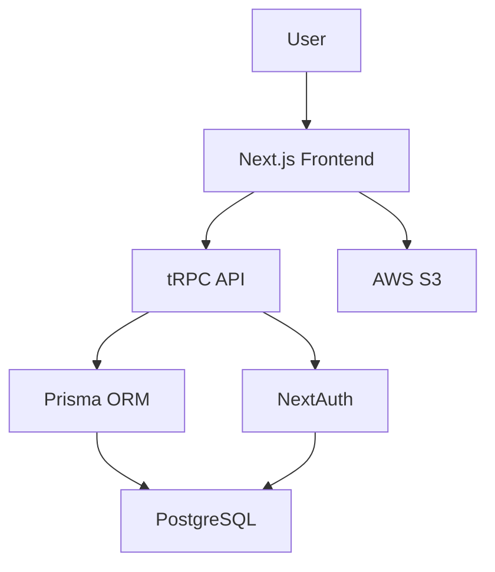

# Claude Code Integration Patterns

## Overview

Codex/GeminiからClaude Codeを呼び出す際の具体的な統合パターン集。

## Pattern 1: Read-Only Design Consultation

### Use Case

- 設計案のレビュー
- アーキテクチャ分析
- コードベース理解

### Pattern

```bash
claude -p "{design question or analysis task}" \
  --allowedTools "Read,Glob,Grep" \
  --model sonnet \
  2>/dev/null > .claude/docs/design/consultation-$(date +%Y%m%d-%H%M%S).md
```

### Example

```bash
# Architecture analysis
claude -p "Analyze current authentication architecture.
Files: src/auth/**/*.ts
Output: Component diagram, data flow, security assessment" \
  --allowedTools "Read,Glob,Grep" \
  --model sonnet \
  2>/dev/null > .claude/docs/design/auth-analysis.md

# Design review
claude -p "Review proposed microservice architecture.
Design doc: .claude/docs/design/microservice-proposal.md
Evaluate: Scalability, complexity, migration path" \
  --allowedTools "Read,Glob,Grep" \
  --model sonnet \
  2>/dev/null > .claude/docs/design/microservice-review.md
```

### Tool Restrictions

- **Read**: ファイル内容の読み取り
- **Glob**: ファイルパターン検索
- **Grep**: コード内容検索

**No writes** → 安全な分析専用パターン

## Pattern 2: Design with Prototyping

### Use Case

- プロトタイプ作成
- 設計ドキュメント生成
- サンプルコード作成

### Pattern

```bash
claude -p "{design task with prototype requirement}" \
  --allowedTools "Read,Write,Edit,Glob,Grep" \
  --model sonnet \
  2>/dev/null > .claude/docs/design/prototype-$(date +%Y%m%d-%H%M%S).md
```

### Example

```bash
# Design with sample code
claude -p "Design plugin architecture for dashboard widgets.
Output:
1. Architecture document (.claude/docs/design/plugin-arch.md)
2. Sample plugin interface (src/types/plugin.ts)
3. Example widget implementation (examples/sample-widget.tsx)" \
  --allowedTools "Read,Write,Edit,Glob,Grep" \
  --model sonnet \
  2>/dev/null > .claude/docs/design/plugin-design-log.md

# API spec with examples
claude -p "Design REST API for user management.
Output:
1. OpenAPI spec (.claude/docs/design/api-spec.yaml)
2. Example requests/responses (examples/api-samples.json)
3. Integration guide (.claude/docs/design/api-integration.md)" \
  --allowedTools "Read,Write,Edit,Glob,Grep" \
  --model sonnet \
  2>/dev/null > .claude/docs/design/api-design-log.md
```

### Tool Restrictions

- **Read**: コンテキスト収集
- **Write**: 新規ファイル作成
- **Edit**: 既存ファイル編集
- **Glob/Grep**: 探索

**Writes enabled** → プロトタイプ作成可能

## Pattern 3: Interactive Design Refinement

### Use Case

- 段階的な設計洗練
- フィードバックループ
- 複数イテレーション

### Pattern

```bash
# Iteration 1: Initial design
claude -p "{initial design prompt}" \
  --allowedTools "Read,Write,Glob,Grep" \
  --model sonnet \
  2>/dev/null > .claude/docs/design/design-v1.md

# Iteration 2: Refinement based on feedback
claude -p "Refine design based on feedback:
Previous: .claude/docs/design/design-v1.md
Feedback: {user feedback or constraints}
Output: Updated design addressing concerns" \
  --allowedTools "Read,Write,Edit,Glob,Grep" \
  --model sonnet \
  2>/dev/null > .claude/docs/design/design-v2.md

# Iteration 3: Final design
claude -p "Finalize design:
Previous iterations: v1, v2
Final requirements: {final requirements}
Output: Production-ready design spec" \
  --allowedTools "Read,Write,Edit,Glob,Grep" \
  --model opus \
  2>/dev/null > .claude/docs/design/design-final.md
```

### Example

```bash
# E-commerce checkout design iterations
# V1: Basic flow
claude -p "Design checkout flow. Steps: Cart → Shipping → Payment → Confirmation" \
  --allowedTools "Read,Write,Glob,Grep" \
  --model sonnet \
  2>/dev/null > .claude/docs/design/checkout-v1.md

# V2: Add guest checkout
claude -p "Add guest checkout to design.
Base: .claude/docs/design/checkout-v1.md
New: Support checkout without account creation" \
  --allowedTools "Read,Write,Edit,Glob,Grep" \
  --model sonnet \
  2>/dev/null > .claude/docs/design/checkout-v2.md

# V3: Add payment provider integration
claude -p "Integrate payment providers.
Base: .claude/docs/design/checkout-v2.md
Providers: Stripe, PayPal
Considerations: Security, UX, error handling" \
  --allowedTools "Read,Write,Edit,Glob,Grep" \
  --model opus \
  2>/dev/null > .claude/docs/design/checkout-final.md
```

### Workflow

```
Initial Design → Feedback → Refinement → Feedback → Final Design
     (v1)          │           (v2)          │         (final)
                   └───────────┴─────────────┘
                    Progressive Enhancement
```

## Pattern 4: Bulk Operation with Safety Checks

### Use Case

- 大規模リファクタリング
- 一括ファイル操作
- パターンの全体適用

### Pattern

```bash
claude -p "Bulk operation: {description}
Safety protocol:
1. Dry-run: Preview changes without applying
2. Backup: Create .backup/ directory
3. Validate: Check syntax/types after each change
4. Report: Log all modifications

Target: {file pattern}
Operation: {detailed operation}" \
  --allowedTools "Read,Write,Edit,Glob,Grep,Bash" \
  --model sonnet \
  2>/dev/null > .claude/docs/design/bulk-operation-$(date +%Y%m%d-%H%M%S).md
```

### Example

```bash
# Bulk import path update
claude -p "Update import paths for module reorganization.
Target: All *.ts and *.tsx files in src/
Operation: Replace '@/components' with '@/ui/components'
Safety:
1. Create backup: cp -r src/ .backup/src-$(date +%Y%m%d-%H%M%S)
2. Dry-run: List all affected files
3. Apply changes: Use Edit tool for each file
4. Validate: Run tsc --noEmit
5. Report: List all modified files" \
  --allowedTools "Read,Write,Edit,Glob,Grep,Bash" \
  --model sonnet \
  2>/dev/null > .claude/docs/design/import-path-update.md

# Bulk type annotation addition
claude -p "Add explicit return types to all functions.
Target: src/**/*.ts (exclude *.test.ts)
Operation: Infer return type and add annotation
Safety:
1. Backup: Copy affected files to .backup/
2. Preview: Show first 5 changes for approval
3. Apply: Batch process remaining files
4. Validate: tsc --noEmit && npm test
5. Rollback: Script to restore from .backup/" \
  --allowedTools "Read,Write,Edit,Glob,Grep,Bash" \
  --model opus \
  2>/dev/null > .claude/docs/design/return-type-addition.md
```

### Safety Protocol

1. **Backup**: 変更前のファイルコピー
2. **Dry-run**: 変更のプレビュー
3. **Incremental**: 段階的な適用
4. **Validation**: 各段階での検証
5. **Rollback plan**: 失敗時の復旧手順

## Pattern 5: Design Comparison & Trade-off Analysis

### Use Case

- 複数案の比較
- 技術選定
- トレードオフ評価

### Pattern

```bash
claude -p "Compare design alternatives.
Candidates: {list of alternatives}
Evaluation criteria:
- Performance
- Maintainability
- Scalability
- Developer experience
- Migration cost

Output:
1. Detailed comparison table
2. Pros/cons for each
3. Recommendation based on project context" \
  --allowedTools "Read,Glob,Grep,Write" \
  --model opus \
  2>/dev/null > .claude/docs/design/comparison-$(date +%Y%m%d-%H%M%S).md
```

### Example

```bash
# State management comparison
claude -p "Compare state management solutions for React.
Candidates: Redux Toolkit, Zustand, Jotai, React Context + useReducer
Project context: Medium-sized SaaS dashboard, TypeScript, Next.js 14
Evaluation:
- Bundle size impact
- Learning curve for team
- TypeScript integration
- DevTools support
- Ecosystem maturity

Output: Comparison matrix + recommendation" \
  --allowedTools "Read,Glob,Grep,Write" \
  --model opus \
  2>/dev/null > .claude/docs/design/state-management-comparison.md

# Database choice
claude -p "Compare database options.
Use case: Multi-tenant SaaS, 1M+ records per tenant
Candidates: PostgreSQL, MongoDB, PlanetScale, Supabase
Criteria:
- Multi-tenancy support
- Query performance
- Operational complexity
- Cost at scale
- TypeScript ORM options

Output: Technical assessment + cost analysis" \
  --allowedTools "Read,Glob,Grep,Write" \
  --model opus \
  2>/dev/null > .claude/docs/design/database-comparison.md
```

### Output Structure

```markdown
# Design Comparison: {Topic}

## Summary

- Winner: {recommended option}
- Key factors: {decision factors}

## Detailed Comparison

| Criterion       | Option A   | Option B   | Option C |
| --------------- | ---------- | ---------- | -------- |
| Performance     | ⭐⭐⭐⭐⭐ | ⭐⭐⭐     | ⭐⭐⭐⭐ |
| Maintainability | ⭐⭐⭐     | ⭐⭐⭐⭐⭐ | ⭐⭐⭐⭐ |
| ...             | ...        | ...        | ...      |

## Pros & Cons

### Option A

**Pros**: ...
**Cons**: ...

### Option B

**Pros**: ...
**Cons**: ...

## Recommendation

Based on project context: {context}
Recommended: {option}
Rationale: {detailed reasoning}
```

## Pattern 6: Requirement Clarification Dialogue

### Use Case

- 曖昧な要求の整理
- 隠れた要件の発見
- ステークホルダーとの対話準備

### Pattern

```bash
claude -p "Clarify ambiguous requirement.
User request: '{user input}'
Current context: {project context}

Task:
1. Identify ambiguities
2. List possible interpretations
3. Generate clarifying questions
4. Propose default assumptions

Output: Structured clarification document" \
  --allowedTools "Read,Glob,Grep,Write" \
  --model sonnet \
  2>/dev/null > .claude/docs/design/requirement-clarification-$(date +%Y%m%d-%H%M%S).md
```

### Example

```bash
# Vague performance request
claude -p "Clarify: 'Make the app faster'
Context:
- Next.js 14 app
- Current metrics: LCP 3.5s, FID 250ms, CLS 0.25
- User complaint: 'Pages load slowly'

Output:
1. Possible interpretations (SSR, client bundle, API latency, etc.)
2. Clarifying questions
3. Recommended metrics to track
4. Default optimization priorities" \
  --allowedTools "Read,Glob,Grep,Write" \
  --model sonnet \
  2>/dev/null > .claude/docs/design/performance-clarification.md

# Underspecified feature
claude -p "Clarify: 'Add export functionality'
Context: Dashboard with user analytics data
Current data: User profiles, activity logs, reports

Output:
1. Export formats (CSV, JSON, Excel, PDF?)
2. Export scope (All data, filtered, date range?)
3. Trigger points (Manual, scheduled, API?)
4. Data transformations (Raw, aggregated?)
5. Security considerations (PII, access control?)" \
  --allowedTools "Read,Glob,Grep,Write" \
  --model sonnet \
  2>/dev/null > .claude/docs/design/export-feature-clarification.md
```

### Output Template

```markdown
# Requirement Clarification: {Feature}

## Original Request

"{user input}"

## Identified Ambiguities

1. {ambiguity 1}
2. {ambiguity 2}
   ...

## Possible Interpretations

### Interpretation A

{description}
**Assumptions**: ...
**Implications**: ...

### Interpretation B

{description}
**Assumptions**: ...
**Implications**: ...

## Clarifying Questions

1. {question 1}
2. {question 2}
   ...

## Recommended Defaults

Based on common patterns and project context:

- {default assumption 1}
- {default assumption 2}
  ...

## Next Steps

1. Present questions to user
2. Document answers
3. Create detailed spec based on clarified requirements
```

## Pattern 7: Architecture Visualization

### Use Case

- システム全体図の作成
- コンポーネント関係の可視化
- データフロー図

### Pattern

```bash
claude -p "Visualize architecture.
System: {system description}
Components: {list of components}
Output formats:
1. Text-based component diagram
2. Mermaid diagram
3. Architectural decision records (ADR)
4. Data flow description

Save diagrams to: .claude/docs/design/diagrams/" \
  --allowedTools "Read,Write,Glob,Grep" \
  --model sonnet \
  2>/dev/null > .claude/docs/design/architecture-visualization.md
```

### Example

```bash
# System architecture diagram
claude -p "Visualize full system architecture.
System: E-commerce platform
Components:
- Frontend: Next.js 14, React Server Components
- Backend: tRPC, Prisma, PostgreSQL
- Auth: NextAuth.js
- Storage: AWS S3
- Email: Resend
- Payments: Stripe

Output:
1. Component diagram (Mermaid)
2. Data flow: User request → Response
3. Authentication flow
4. Payment processing flow
5. ADR for key decisions" \
  --allowedTools "Read,Write,Glob,Grep" \
  --model opus \
  2>/dev/null > .claude/docs/design/ecommerce-architecture.md

# Microservice interaction diagram
claude -p "Diagram microservice interactions.
Services:
- API Gateway (Kong)
- User Service (Node.js)
- Order Service (Go)
- Payment Service (Python)
- Notification Service (Node.js)
Message bus: RabbitMQ

Output:
1. Service dependency graph
2. Message flow diagrams
3. Failure scenarios
4. Scaling considerations" \
  --allowedTools "Read,Write,Glob,Grep" \
  --model opus \
  2>/dev/null > .claude/docs/design/microservice-diagram.md
```

### Diagram Formats

### Mermaid Example:



## Pattern 8: Error Handling & Rollback

### Use Case

- 設計時のエラーハンドリング戦略
- 変更の安全な適用
- ロールバック計画

### Pattern

```bash
claude -p "Design with error handling and rollback.
Task: {design or operation task}
Error scenarios:
- {scenario 1}
- {scenario 2}
...

Requirements:
1. Validate before applying changes
2. Create restoration points
3. Log all operations
4. Provide rollback script

Output:
1. Main design/operation
2. Error handling strategy
3. Rollback procedures
4. Validation checklist" \
  --allowedTools "Read,Write,Edit,Glob,Grep,Bash" \
  --model sonnet \
  2>/dev/null > .claude/docs/design/safe-operation-$(date +%Y%m%d-%H%M%S).md
```

### Example

```bash
# Safe database migration design
claude -p "Design safe database migration.
Migration: Add 'role' column to users table with default value
Production: 1M+ users

Safety requirements:
1. Zero downtime
2. Rollback plan if migration fails
3. Data validation
4. Performance impact assessment

Output:
1. Migration script (with batching)
2. Rollback script
3. Pre-flight checks
4. Post-migration validation
5. Monitoring queries" \
  --allowedTools "Read,Write,Glob,Grep" \
  --model opus \
  2>/dev/null > .claude/docs/design/safe-db-migration.md
```

## Best Practices Summary

### 1. Tool Selection

| Task Type          | Recommended Tools                |
| ------------------ | -------------------------------- |
| Read-only analysis | `Read,Glob,Grep`                 |
| Design + prototype | `Read,Write,Edit,Glob,Grep`      |
| Bulk operations    | `Read,Write,Edit,Glob,Grep,Bash` |

### 2. Model Selection

| Complexity | Model  | Use Case                                |
| ---------- | ------ | --------------------------------------- |
| Simple     | Haiku  | Quick questions, simple analysis        |
| Standard   | Sonnet | Most design tasks, prototyping          |
| Complex    | Opus   | Architecture design, trade-off analysis |

### 3. Output Management

- すべての出力を `.claude/docs/design/` に保存
- タイムスタンプ付きファイル名: `task-$(date +%Y%m%d-%H%M%S).md`
- バージョニング: `design-v1.md`, `design-v2.md`, `design-final.md`

### 4. Safety Protocols

1. **Backup**: 変更前のコピー作成
2. **Validation**: 各段階での検証
3. **Logging**: すべての操作を記録
4. **Rollback**: 復旧手順を準備

### 5. Context Management

- 長時間タスク → サブプロセス（バックグラウンド）
- 短時間タスク → 直接呼び出しOK
- メインプロセスのコンテキスト汚染を避ける
