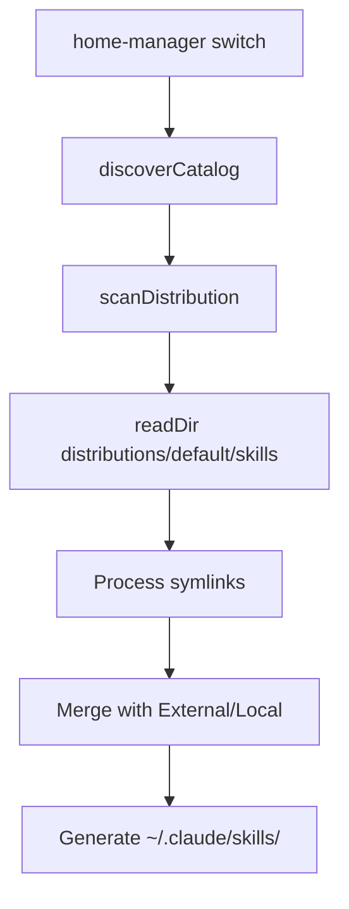

# Distributions Architecture

## Overview

The distributions layer is implemented in `agents/nix/lib.nix` and integrates with the existing `discoverCatalog()` function. It provides a symlink-based bundling mechanism that coexists with the existing Local/External sources.

---

## Nix Implementation

### scanDistribution Function

```nix
# agents/nix/lib.nix (simplified)
scanDistribution = distributionPath:
  if !pathExists distributionPath then
    {}
  else
    let
      processSkillEntry = name: type:
        let entryPath = distributionPath + "/${name}";
        in
          if type == "directory" || type == "symlink" then
            if pathExists (entryPath + "/SKILL.md") then
              { ${name} = { id = name; path = entryPath; source = "distribution"; }; }
            else
              scanSource "distribution" entryPath
          else {};

      entries = readDir distributionPath;
      scannedResults = mapAttrsToList processSkillEntry entries;
    in
      foldl' (a: b: a // b) {} scannedResults;
```

**Key features**:

- **Directory/symlink support**: Handles both direct directories and symlinks
- **Recursive scanning**: Uses `scanSource` for nested structures
- **Lazy evaluation**: Only scans if `distributionPath` exists
- **Source tagging**: All entries marked with `source = "distribution"`

### Integration with discoverCatalog

```nix
# agents/nix/lib.nix (simplified)
discoverCatalog = { distributionsPath ? null, ... }:
  let
    distributionSkills =
      if distributionsPath != null then
        scanDistribution (distributionsPath + "/skills")
      else
        {};

    localSkills = scanSource "local" skillsPath;
    externalSkills = scanExternal skillsExternalPath;
  in
    # Priority: Distribution < External < Local
    distributionSkills // externalSkills // localSkills;
```

**Priority mechanism**: Right-associative `//` operator ensures Local overwrites External, which overwrites Distribution.

---

## Command Processing

Commands support subdirectory structures:

```nix
# agents/nix/lib.nix (simplified)
processCommandEntry = name: type:
  let entryPath = commandsPath + "/${name}";
  in
    if type == "directory" || type == "symlink" then
      if pathExists (entryPath + "/command.ts") then
        { ${name} = { id = name; path = entryPath; source = "distribution"; }; }
      else
        scanCommandSource "distribution" entryPath
    else {};
```

**Subdirectory example**:

```
distributions/default/commands/
├── kiro -> ../../../commands-internal/kiro/  (symlink to dir)
│   ├── spec-init/
│   │   └── command.ts
│   ├── spec-tasks/
│   │   └── command.ts
```

Each subdirectory with `command.ts` is treated as a separate command.

---

## Cyclic Reference Prevention

### Static Paths

Distributions are scanned **before** sources to prevent circular dependencies:

```nix
# Scan order in discoverCatalog
1. distributionSkills (static paths, no evaluation)
2. externalSkills
3. localSkills (overwrites conflicts)
```

### Path Resolution

```nix
# Static path resolution
distributionSkills = scanDistribution (distributionsPath + "/skills");
# → /nix/store/...-distributions/default/skills

# Symlinks resolve at filesystem level, not Nix level
# Example: distributions/default/skills/my-skill -> ../../../skills-internal/my-skill
# Nix sees: /home/j138/.config/agents/skills-internal/my-skill
```

**Key insight**: Symlinks are dereferenced by the filesystem, so Nix only sees the target paths. This prevents evaluation loops.

---

## Deployment Flow



### Step-by-step

1. **Nix evaluation**: `scanDistribution()` reads `distributions/default/skills/`
2. **Symlink processing**: Each symlink is checked for `SKILL.md`
3. **Catalog merge**: Distribution entries merged with External/Local
4. **Priority resolution**: Local overwrites conflicts
5. **Deployment**: Symlinks created in `~/.claude/skills/`

---

## Verification

```bash
# Check Nix evaluation (dry-run)
home-manager build --flake ~/.config --impure --dry-run

# Inspect generated catalog
nix eval --json --impure --expr '
  let lib = import ~/agents/nix/lib.nix { inherit (import <nixpkgs> {}) lib; };
      catalog = lib.discoverCatalog {
        distributionsPath = ~/agents/distributions/default;
        # ... other paths
      };
  in builtins.attrNames catalog.skills
' | jq

# Verify deployed skills
ls -la ~/.claude/skills/
```

---

## Design Rationale

### Why Symlinks?

- **No duplication**: Source of truth remains in `skills-internal/`
- **Easy updates**: Changes to source automatically reflected
- **Nix-friendly**: Symlinks are resolved at filesystem level
- **Bundle flexibility**: Same skill can appear in multiple distributions

### Why Static Scanning?

- **Prevents cycles**: No evaluation dependencies between distributions and sources
- **Predictable order**: Distribution < External < Local
- **Simple debugging**: Scan order is explicit

### Why Optional?

- **Backwards compatibility**: Existing workflows (Local/External) unaffected
- **Incremental adoption**: Teams can opt-in gradually
- **Zero overhead**: If `distributionsPath = null`, no scanning occurs

---

## Related Files

- **agents/nix/lib.nix**: Main implementation
- **home/j138/.agents/flake.nix**: Home Manager integration (calls `discoverCatalog`)
- **agents/distributions/default/**: Example bundle

---

## Future Considerations

- **Multi-bundle support**: Currently single distribution (`default/`), could support multiple
- **Bundle versioning**: Semantic versioning for bundle releases
- **Validation tools**: CLI for checking bundle integrity
