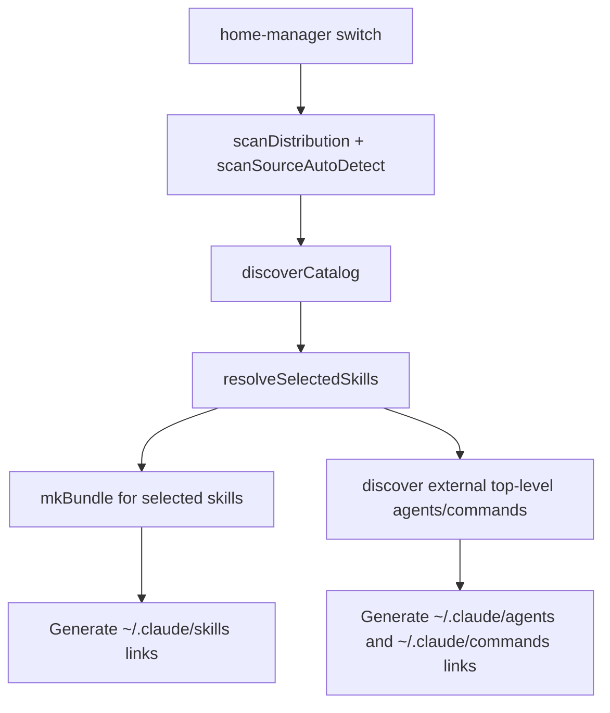

# Distributions Architecture

## Overview

The current distributions runtime is implemented across `agents/nix/lib.nix` and `agents/nix/module.nix`.

- Bundled assets live under `agents/src/`
- External assets come from flake-input `sources`
- Skill precedence is `Distribution > External`
- `skills.enable = null` means "select all discovered skills"

The active deployment paths are:

- Skills: bundled from the selected catalog into the Nix store bundle
- Rules: linked directly from bundled distribution assets
- Agents: merged as `externalAgents // distributionAgents`, so bundled agents win on conflicts
- Commands: linked only from external top-level command sources selected through skill ownership

`agents/src/commands/` is not part of the active Home Manager deployment path.

---

## Nix Implementation

### `scanDistribution`

`scanDistribution` reads the bundled source tree under `agents/src/` and returns:

```nix
{
  skills = { ... };
  commands = /path/or/null;
  config = /path/or/null;
  rules = { ... };
  agents = { ... };
}
```

The active bundled assets are discovered from:

- `agents/src/skills/`
- `agents/src/rules/`
- `agents/src/agents/`

Skill entries are accepted when either of these layouts exists:

```text
agents/src/skills/<skill-id>/SKILL.md
agents/src/skills/<skill-id>/skills/SKILL.md
```

This lets the runtime handle both direct skill directories and nested source layouts.

### `discoverCatalog`

```nix
# agents/nix/lib.nix (simplified)
discoverCatalog =
  {
    sources,
    distributionsPath ? null,
  }:
  let
    distributionResult =
      if distributionsPath != null && pathExists distributionsPath then
        scanDistribution distributionsPath
      else
        {
          skills = { };
          commands = null;
          config = null;
          rules = { };
          agents = { };
        };

    externalSkills = builtins.foldl' (
      acc: srcName:
      acc // scanSourceAutoDetect srcName sources.${srcName}
    ) { } (attrNames sources);
  in
  externalSkills // distributionResult.skills;
```

Because `//` is right-biased, bundled skills from `agents/src/skills/` override external skills with the same ID.

### `resolveSelectedSkills`

Both the Home Manager module and flake package path use the same selection helper:

```nix
resolveSelectedSkills =
  { catalog, enable }:
  let
    distributionSkillIds = attrNames (
      filterAttrs (_: skill: skill.source == "distribution") catalog
    );
    enableList =
      if enable == null then
        attrNames catalog
      else
        unique (enable ++ distributionSkillIds);
    selectedSkills =
      if enable == null then
        catalog
      else
        selectSkills {
          inherit catalog;
          enable = enableList;
        };
  in
  {
    inherit distributionSkillIds enableList selectedSkills;
    selectedSkillSources = unique (map (skill: skill.source) (builtins.attrValues selectedSkills));
  };
```

Behavior:

- `enable = null`: all discovered bundled and external skills are selected
- `enable = [ ... ]`: requested skills are selected, and bundled distribution skills are always added

---

## Deployment Paths

### Skills

Selected skills are copied into a Nix store bundle via `mkBundle`, then linked into each enabled target's `.../skills/` directory.

```text
catalog -> resolveSelectedSkills -> mkBundle -> home.file links
```

### Rules

Bundled rules are linked directly from `distributionResult.rules` into each target's `.../rules/` directory.

Rules currently come only from the bundled distribution tree.

### Agents

Top-level agents are merged like this:

```nix
mergedAgents = externalAgents // distributionResult.agents;
```

Bundled agents win on duplicate IDs because the bundled attrset is on the right-hand side.

### Commands

Top-level commands are currently discovered only from external sources:

```nix
externalCommands = agentLib.discoverExternalAssets {
  inherit (cfg) sources;
  assetType = "commands";
  enabledSources = selectedSkillSources;
};
```

That means:

- command deployment is gated by which skill sources are selected
- bundled `agents/src/commands/` entries are not linked by the Home Manager module

---

## Directory Structure

### Bundled Source of Truth

```text
agents/src/
├── skills/
├── rules/
└── agents/
```

### External Sources

External sources are derived from `nix/agent-skills-sources.nix` and materialized by `nix/sources.nix`.

Each source contributes:

- `path`: skill catalog root
- optional `agentsPath`
- optional `commandsPath`
- optional `idPrefix`

---

## Cyclic Reference Prevention

Distributions are scanned from static filesystem paths before Home Manager link generation:

```nix
1. distributionResult = scanDistribution(distributionsPath)
2. externalSkills = scanSourceAutoDetect(...)
3. catalog = externalSkills // distributionResult.skills
4. selectedSkills = resolveSelectedSkills(...)
5. home.file links are generated
```

Because Nix reads source paths first and deployment output later, bundled entries should point to real source paths under `agents/src/` or external checkouts, not to generated directories such as `~/.claude/skills/`.

Broken symlinks are ignored because `pathExists` fails during scanning.

---

## Deployment Flow



---

## Verification

```bash
# Validate flake outputs and checks
/nix/var/nix/profiles/default/bin/nix flake check --impure

# Build the real Home Manager activation package
/nix/var/nix/profiles/default/bin/nix build .#homeConfigurations.$USER.activationPackage --impure

# Run agent-skills-specific Nix validation
mise run ci:nix
```

To inspect current source attribution:

```bash
mise run skills:list 2>/dev/null | jq '.skills[] | {id, source}'
```

---

## Design Rationale

- Distribution wins over external: bundled skills and agents are the repo-owned source of truth
- Shared selection logic: flake packaging and Home Manager use the same `resolveSelectedSkills` helper
- Null means all discovered: module defaults match the option description
- Asset-specific deployment: skills are bundled, while rules/agents/commands are linked by asset type
