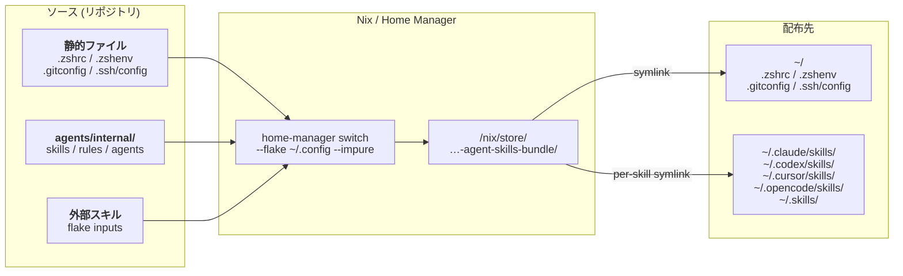

# Nix / Home Manager リファレンス

最終更新: 2026-03-23
対象: macOS ユーザー（dotfiles 管理者）
タグ: `category/infra`, `tool/nix`, `tool/home-manager`, `layer/system`, `environment/macos`

Nix Home Manager の配布アーキテクチャ・メンテナンス運用ポリシーと詳細リファレンスです。

🔗 Claude Rules: [`.claude/rules/nix-maintenance.md`](../../.claude/rules/nix-maintenance.md)（コンパクト版）

## 配布アーキテクチャ

### 全体フロー



配布の流れ:

- 静的ファイル → `~/` 直下に symlink 配布
- agents/internal + 外部スキル → `/nix/store` にバンドル → 各ツールの `skills/` に per-skill symlink

### スキル優先度

| 優先度 | ソース       | パス                         |
| ------ | ------------ | ---------------------------- |
| 高     | local        | `agents/internal/skills/`    |
| 中     | distribution | flake inputs 経由バンドル    |
| 低     | external     | `agents/external/` (symlink) |

---

## Generations 保持ポリシー

### 保持基準

90日または20世代（いずれか先に到達した方）を保持。

理由:

- 90日：約3ヶ月分の履歴を保持し、長期的なロールバックに対応
- 20世代：頻繁に変更する場合でも、十分な世代数を確保
- ディスク容量と復旧柔軟性のバランスを考慮

### 削除対象

以下の基準を**両方とも**満たす generations を削除：

1. **90日以前**に作成された
2. または、**最新から21世代以上前**の generation

**現在の generation は常に保持**（削除されない）

### 除外ルール

以下の generations は保持期間に関わらず保持：

- 現在アクティブな generation（`current`）
- 手動でマークした重要な generation（将来的な機能）

---

## Garbage Collection 運用

### GC とは

Nix の `/nix/store` には過去にインストールしたパッケージやビルド成果物が蓄積されます。GC は、どの generation からも参照されていない不要な store オブジェクトを削除する処理です。

### GC 実行タイミング

必須: 月次メンテナンス時（毎月1回）

推奨実行ケース:

- generations 削除後
- `/nix/store` のディスク使用量が50%を超えた場合
- 大規模な flake update の後

### 3パターンの使い分け

#### 標準クリーンアップ（月次）

```bash
home-manager remove-generations 90d
nix-collect-garbage -d
df -h /nix/store
```

#### 保守的なクリーンアップ（頻繁に変更する期間）

```bash
home-manager remove-generations +20
nix-collect-garbage -d
df -h /nix/store
```

#### アグレッシブなクリーンアップ（緊急時のみ）

```bash
# 警告: 現在の generation 以外すべて削除。ロールバック不可。
# 実行前に重要な設定変更を git commit すること。
home-manager remove-generations all
nix-collect-garbage -d
nix-collect-garbage --delete-old
df -h /nix/store
```

---

## ディスク使用量監視

### 監視閾値

| 使用率 | 状態 | アクション                              |
| ------ | ---- | --------------------------------------- |
| < 50%  | 正常 | 定期メンテナンスのみ                    |
| 50-70% | 注意 | 早めに GC 実行を検討                    |
| 70-85% | 警告 | 即座に GC 実行、不要な generations 削除 |
| > 85%  | 危険 | アグレッシブなクリーンアップ実施        |

### 確認コマンド

```bash
df -h /nix/store                           # 使用量確認
du -sh /nix/store/* | sort -rh | head -20  # 最大の store パスを特定
home-manager generations | wc -l           # generations 数確認
```

### ベストプラクティス

1. 月次 GC で generations と store を同時クリーンアップ
2. 不要な flake inputs を `flake.nix` から削除
3. flake update は必要な時のみ実行
4. `substituters` でバイナリキャッシュを活用

---

## 定期メンテナンススケジュール

| 頻度   | タスク                | コマンド                                                        |
| ------ | --------------------- | --------------------------------------------------------------- |
| 月次   | Generations 削除 + GC | `home-manager remove-generations 90d && nix-collect-garbage -d` |
| 月次   | ディスク使用量確認    | `df -h /nix/store`                                              |
| 四半期 | クリーンアップ検証    | generations 数・ディスク使用量推移の確認                        |
| 年次   | 運用ポリシーの見直し  | 保持期間・閾値の調整検討                                        |

推奨タイミング: 毎月第一日曜日。Homebrew・mise のメンテナンスと同時実施。

---

## トラブルシューティング

### Q: GC 実行後もディスク使用量が減らない

原因: まだ参照されている store パスが多い、最近の generations が大量パッケージを参照。

```bash
home-manager generations | wc -l
home-manager remove-generations 30d   # より短い期間で削除
nix-collect-garbage -d
df -h /nix/store
```

### Q: "cannot delete path ... because it is in use" エラー

原因: 削除しようとしている store パスが実行中プロセスで使用されている。

```bash
ps aux | grep nix
sudo launchctl stop org.nixos.nix-daemon
sudo launchctl start org.nixos.nix-daemon
nix-collect-garbage -d
```

### Q: Generations 削除が "Permission denied" エラー

原因: プロファイルのパーミッション問題。

```bash
ls -la ~/.local/state/nix/profiles/
chmod -R u+w ~/.local/state/nix/profiles/
home-manager remove-generations 90d
```

### Q: GC 後に Home Manager 適用が失敗する

原因: 必要な store パスが削除された可能性。

```bash
cd ~/.config
nix flake update
home-manager switch --flake . --impure
# それでも失敗する場合
rm flake.lock && nix flake update
home-manager switch --flake . --impure
```

---

## 参考資料

- [Nix Package Management - Garbage Collection](https://nixos.org/manual/nix/stable/package-management/garbage-collection.html)
- [Home Manager Manual - Generations](https://nix-community.github.io/home-manager/index.html#sec-usage-generations)
- `docs/tools/home-manager.md` - Home Manager 詳細リファレンス
- `docs/tools/workflows.md` - 全体的なメンテナンスワークフロー
- `docs/disaster-recovery.md` - ディザスタリカバリ手順
- `docs/tools/home-manager.md` - スキル配布問題の対処法
